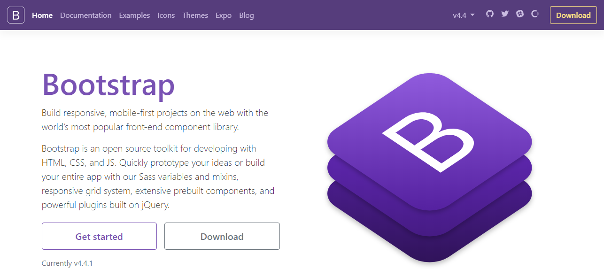
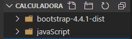

# Calculadora com Html, CSS, Bootstrap e JavaScript


## Importando Bootstrap no projeto

Utilizando html, css, bootstrap e JavaScript, podemos criar uma calculadora bem estilizada e funcional, e o melhor: é simples. 

Primeiro criaremos uma pasta para guardar nossos arquivos. Por exemplo: calculadora. Dentro dessa pasta criaremos um documento com o nome de calculadora.html. 

A estrutura desse arquivo será assim:

 `````````html
<!DOCTYPE html>
<html lang="pt-br">
<head>
    <meta charset="UTF-8">
    <title>Calculadora</title>
</head>
<body>  
</body>
</html>
 ````````````
O próximo passo será acrescentar ao projeto o Bootstrap, você poderá importar através de CDN, essa é a forma de importar no seu projeto via link. Veja um exemplo:


````````````````````````````````````````html
<!-- Latest compiled and minified CSS -->
<link rel="stylesheet" href="https://maxcdn.bootstrapcdn.com/bootstrap/3.3.7/css/bootstrap.min.css" integrity="sha384-BVYiiSIFeK1dGmJRAkycuHAHRg32OmUcww7on3RYdg4Va+PmSTsz/K68vbdEjh4u" crossorigin="anonymous">

````````````````````````````````````````

````````````````````````````````````````html
<!-- Optional theme -->
<link rel="stylesheet" href="https://maxcdn.bootstrapcdn.com/bootstrap/3.3.7/css/bootstrap-theme.min.css" integrity="sha384-rHyoN1iRsVXV4nD0JutlnGaslCJuC7uwjduW9SVrLvRYooPp2bWYgmgJQIXwl/Sp" crossorigin="anonymous">
``````````````````````````````````````````

````````````````````````````````````````````````````````````html
<!-- Latest compiled and minified JavaScript -->
<script src="https://maxcdn.bootstrapcdn.com/bootstrap/3.3.7/js/bootstrap.min.js" integrity="sha384-Tc5IQib027qvyjSMfHjOMaLkfuWVxZxUPnCJA7l2mCWNIpG9mGCD8wGNIcPD7Txa" crossorigin="anonymous"></script>
````````````````````````````````````````````````````````````

Essas linhas acima são importadas dentro da tag ``<head>``do html, então teriamos algo assim:

``````````````````````````````````````````````````````html
<!DOCTYPE html>
<html lang="pt-br">
<head>
    <meta charset="UTF-8">
    <link rel="stylesheet" href="https://maxcdn.bootstrapcdn.com/bootstrap/3.3.7/css/bootstrap.min.css" integrity="sha384-BVYiiSIFeK1dGmJRAkycuHAHRg32OmUcww7on3RYdg4Va+PmSTsz/K68vbdEjh4u" crossorigin="anonymous">
    <link rel="stylesheet" href="https://maxcdn.bootstrapcdn.com/bootstrap/3.3.7/css/bootstrap-theme.min.css" integrity="sha384-rHyoN1iRsVXV4nD0JutlnGaslCJuC7uwjduW9SVrLvRYooPp2bWYgmgJQIXwl/Sp" crossorigin="anonymous">
    <script src="https://maxcdn.bootstrapcdn.com/bootstrap/3.3.7/js/bootstrap.min.js" integrity="sha384-Tc5IQib027qvyjSMfHjOMaLkfuWVxZxUPnCJA7l2mCWNIpG9mGCD8wGNIcPD7Txa" crossorigin="anonymous"></script>
    <title>Calculadora</title>
</head>
<body>
    
</body>
</html>

``````````````````````````````````````````````````````
Mas essa prática de importar via CDN não é muito interessante, pois se o link for alterado ou retirado do ar, sua aplicação não poderá encontrar o link e perderá a estilização. Portanto, iremos baixar a dependência e alocarmos no projeto.

Para isso acessar o site do Bootstrap: https://getbootstrap.com/. Na tela inicial clicar em "Download". 



Após realizar o Download, extrair a pasta dentro do projeto.



Feito isso, na tag ``<head>`` adicionaremos dois links:

```````````````````````````
<link rel="stylesheet" href="bootstrap-4.4.1-dist/css/bootstrap.min.css">

<script src="bootstrap-4.4.1-dist/js/bootstrap.min.js"></script>

``````````````````````````````
O primeiro refere-se ao CSS do Bootstrap e o segundo ao JavaScript do Bootstrap.

Pronto! Bootstrap já está adicionado ao nosso projeto.

## Mão na massa: Criando o Html

Vamos criar um documento padrão de Html e criaremos uma tabela que será nosso molde para a calculadora. Para isso iremos na documentação do Bootstrap e usaremos o componente "Bordered table":
Copie e cole esse código dentro do tag body no html.
``````````````````````````````````````html
<table class="table table-bordered table-dark">
  <thead>
    <tr>
      <th scope="col">#</th>
      <th scope="col">First</th>
      <th scope="col">Last</th>
      <th scope="col">Handle</th>
    </tr>
  </thead>
  <tbody>
    <tr>
      <th scope="row">1</th>
      <td>Mark</td>
      <td>Otto</td>
      <td>@mdo</td>
    </tr>
    <tr>
      <th scope="row">2</th>
      <td>Jacob</td>
      <td>Thornton</td>
      <td>@fat</td>
    </tr>
    <tr>
      <th scope="row">3</th>
      <td colspan="2">Larry the Bird</td>
      <td>@twitter</td>
    </tr>
  </tbody>
</table>
````````````````````````````````````````
A tabela acima construirá uma tabela com bordas brancas e fundo escuro. Agora vamos organizar nossa tabela para que fique com as dimensões corretas e possamos adicionar os botões da nossa calculadora.

````````````````````````````````````````````````````html
 <div class="calculadora">
        <table class="table table-bordered table-dark col-xs-6 col-sm-6">
            <thead>
                <tr>
                    <th colspan="3"></th>
                    <td class="td"></td>
                </tr>
            </thead>
            <tbody>
                <tr>
                    <td class="td"></td>
                    <td class="td" ></td>
                    <td class="td"></td>
                    <td class="td"></td>
                </tr>
                <tr>
                    <td class="td"></td>
                    <td class="td"></td>
                    <td class="td"></td>
                    <td class="td"></td>

                </tr>
                <tr>
                    <td class="td"></td>
                    <td class="td"></td>
                    <td class="td"></td>
                    <td class="td"></td>
                </tr>
                <tr>
                    <td class="td"></td>
                    <td class="td"></td>
                    <td class="td"></td>
                    <td class="td"></td>
                </tr>
            </tbody>
        </table>
    </div>
``````````````````````````````````````````````````````````````````
Observe que foi criado uma div com a class calculadora e dentro dela se encontra a nossa tabela. Temos então que o tamanho dessa tabela é col-xs-6 col-sm-6 e que a primeira linha da tabela ocupara 3 colunas "colspan="3". Veja o resultado:


Agora iremos adicionar os botões em nossa calculadora. Utilizaremos o componente "button":

``````````````````````html
<button type="button" class="btn btn-secondary">Secondary</button>
``````````````````````````

Vamos adiciona-los em nossa tabela:

```````````````````````````````````html
<div class="calculadora">
        <table class="table table-bordered table-dark col-xs-6 col-sm-6">
            <thead>
                <tr>
                    <th colspan="3">
                    </th>
                    <td class="td"><button type="button"
                            class="btn btn-secondary col-xs-12 col-sm-12 col-md-12 col-lg-12"
                            value="/">/</button></td>
                </tr>
            </thead>
            <tbody>
                <tr>
                    <td class="td"><button type="button"
                            class="btn btn-secondary col-lg-12"
                            value="7">7</button></td>
                    <td class="td" ><button type="button"
                            class="btn btn-secondary col-xs-12 col-sm-12 col-md-12 col-lg-12"
                            value="8">8</button></td>
                    <td class="td"><button type="button"
                            class="btn btn-secondary col-xs-12 col-sm-12 col-md-12 col-lg-12"
                            value="9">9</button></td>
                    <td class="td"><button type="button"
                            class="btn btn-secondary col-xs-12 col-sm-12 col-md-12 col-lg-12"
                            value="x">x</button></td>
                </tr>
                <tr>
                    <td class="td"><button type="button"
                            class="btn btn-secondary col-xs-12 col-sm-12 col-md-12 col-lg-12"
                            value="4">4</button></td>
                    <td class="td"><button type="button"
                            class="btn btn-secondary col-xs-12 col-sm-12 col-md-12 col-lg-12"
                            value="5">5</button></td>
                    <td class="td"><button type="button"
                            class="btn btn-secondary col-xs-12 col-sm-12 col-md-12 col-lg-12"
                            value="6">6</button></td>
                    <td class="td"><button type="button"
                            class="btn btn-secondary col-xs-12 col-sm-12 col-md-12 col-lg-12"
                            value="-">-</button></td>

                </tr>
                <tr>
                    <td class="td"><button type="button"
                            class="btn btn-secondary col-xs-12 col-sm-12 col-md-12 col-lg-12"
                            value="1">1</button></td>
                    <td class="td"><button type="button"
                            class="btn btn-secondary col-xs-12 col-sm-12 col-md-12 col-lg-12"
                            value="2">2</button></td>
                    <td class="td"><button type="button"
                            class="btn btn-secondary col-xs-12 col-sm-12 col-md-12 col-lg-12"
                            value="3">3</button></td>
                    <td class="td"><button type="button"
                            class="btn btn-secondary col-xs-12 col-sm-12 col-md-12 col-lg-12"
                            value="+">+</button></td>
                </tr>
                <tr>
                    <td colspan="1" class="td"><button type="button"
                            class="btn btn-secondary col-xs-12 col-sm-12 col-md-12 col-lg-12"
                            value=".">.</button></td>
                    <td class="td"><button type="button"
                            class="btn btn-secondary col-xs-12 col-sm-12 col-md-12 col-lg-12"
                            value="0">0</button></td>
                    <td class="td"><button type="button"
                            class="btn btn-secondary  col-xs-12 col-sm-12 col-md-12 col-lg-12" 
                            value="c">C</button></td>
                    <td class="td"><button type="button"
                            class="btn btn-secondary btn-warning  col-xs-12 col-sm-12 col-md-12 col-lg-12"
                            value="=">=</button></td>
                </tr>
            </tbody>
        </table>
    </div>

````````````````````````````````````````
Por útimo e não menos importante, adicionaremos o input onde será mostrado o nosso resultado. Colocaremos o componte "input" do bootstrap dentro da tag ``<th>`` já colocaremos um id para identifica-lo:
```````````````````````````html
<div class="calculadora">
        <table class="table table-bordered table-dark col-xs-6 col-sm-6">
            <thead>
                <tr>
                    <th colspan="3">
                        <input type="text" class="form-control" id="resultado" aria-describedby="addon-wrapping">
                    </th>
                    <td class="td"><button type="button"
                            class="btn btn-secondary col-xs-12 col-sm-12 col-md-12 col-lg-12"
                            value="/">/</button></td>
                </tr>
            </thead>
            <tbody>
                .
                .
                .
``````````````````````````````````

O resultado da nossa calculadora será:


Observe que foram utilizados os tamanhos "col-sm-12 col-md-12 col-lg-12" para todos os botões. Esse é sistema de Grid do Bootstrap, onde o tamanho máximo é sempre 12, podem varias as combinações até o tamanho 12 (Ex: 3 6 3).Nessa calculadora foi utilizado o tamanho máximo as telas xs: muito pequena, sm: pequena, md: grande, lg: muito grande.

Obs: Utilizei a classe "btn-warning" no botão de sinal de "=" para ficar com a cor em destaque amarelo.

Em um arquivo CSS criado a parte adicionei a seguinte estilização:

``````````````````````````````````CSS
body{
    background-color: black;
    
}

.calculadora{
    margin: 10% 10% 10% 30%;
    
}

input{
    text-align: right;
}
``````````````````````````````````````
## Fazendo nossa calculadora calcular com JavaScript

Agora vamos fazer o nosso JavaScrip, onde manipularemos via DOM os elementos do html e realizaremos os cálculos (Adição, subtração, multiplicação e divisão).


Criaremos um arquivo a parte e o imporemos em nossa página html. 

`````````````````````html
<script src="javaScript/javaScript.js"></script>
``````````````````````````

Antes de colocarmos a mão na massa, vamos pensar um pouco sobre o que precisamos ter para realizarmos nossos cálculos:
1° Receberemos um número antes de digitarmos a operação
2° Receberemos um número depois de digitarmos a operação
3° A operação em si
4° Novo número  (True / False)

Nesse artigo irei trabalhar com variáveis globais, para ser de fácil entendimento. Em um próximo artigo farei a mesma cálculadora mas com funções de CallBack.

Vamos criar as variáveis que representaram os 4 itens citados acima:

````````````````````````javascript
let numeroAntesDaOperacao = 0
let operacao = ""
let numeroDepoisDaOperacao = 0
let novoNumero = false

``````````````````````````````````````

Agora criaremos a primeira função, onde realizaremos a verificação do número que esta sendo digitado, se será um número de unidade, dezena ou centena.

```````````````````````````````javascript
function numeroDigitado(numero) {
    if (novoNumero == false) {
        if (numero !== 0 || numero === 0) {
            numeroAntesDaOperacao = document.getElementById('resultado').value += numero
        } else {
            numeroAntesDaOperacao = document.getElementById('resultado').value = numero
        }
    } else {
        if (numero !== 0 || numero === 0) {
            numeroDepoisDaOperacao = document.getElementById('resultado').value += numero
        } else {
            numeroDepoisDaOperacao = document.getElementById('resultado').value = numero
        }
    }

}
````````````````````````````````````````
Criamos uma função que recebe como parâmtro um numero e verifica o seguinte:
1 ° Número recebido é diferente de 0 ou numero recebido é igual 0. 
Então nossa variável "numeroAntesDaOperacao" receberá o numero recebido mais o próximo numero digitado, por exemplo, se digitarmos o numeral 20, a variável "numeroAntesDaOperacao" guardará primeiro o numero 2 e depois o numero 0, resultando no número 20. Caso o número digitado seja apenas um numeral, a variável armazenará apenas um número.

2° Nessa mesma função, realizamos o mesmo para a variável "numeroDepoisDaOperacao".

Agora trataremos da operação em si. Criaremos um método que verifica qual operação esta sendo relizada e armazena na variável "operação". Uma outra verificação que já poderemos realizar é se teremos um novo número. E como saberemos isso? Ao digitarmos em nossa calculadora uma operação, por exemplo 20 + 30, podemos separar dessa forma: 20 é o numero antes da operação, "+" é a operação, e o número 30 é um novo número e também um número depois da operação. Portanto todo número que for depois da operação será um novo número. Com isso em mente veja como ficará o nosso método:

````````````````````````````javascript
function operacaoDigitada(op) {
    operacao = op;
    if (operacao !== '=')
        novoNumero = true;
    document.getElementById('resultado').value = "";

}
````````````````````````````````````````
Veja que a função ficou bem simples, recebemos a operação (op) e guardamos na variável "operacao". Se a operação for diferente de "=" sabemos então que teremos um novo número, assim a variável "novoNumero" passará a receber o valor "true". Por fim limpamos os campos do input onde é exibido o número que digitamos e o resultado.

Repare que na função "numeroDigitado" foi realizada uma verificação se temos um número novo ou não. Essa verificação se faz necessária para sabermos se o número que esta sendo recebido já é um número novo ou se ainda estamos recebendo um número antes da operação.

Agora criaremos uma nova função, que de fato realizará a opereção:
````````````````````javascript
function realizaOperacao() {

    switch (operacao) {
        case '+':
            document.getElementById('resultado').value = parseFloat(numeroAntesDaOperacao) + parseFloat(numeroDepoisDaOperacao);
            break;
        case '-':
            document.getElementById('resultado').value = parseFloat(numeroAntesDaOperacao) - parseFloat(numeroDepoisDaOperacao);
            break;
        case 'x':
            document.getElementById('resultado').value = parseFloat(numeroAntesDaOperacao) * parseFloat(numeroDepoisDaOperacao);
            break;
        case '/':
            if (numeroDepoisDaOperacao == 0) {
                alert("Divisão por zero não permitida");
                document.getElementById('resultado').value = "";
                return;
            } else {
                document.getElementById('resultado').value = parseFloat(numeroAntesDaOperacao) / parseFloat(numeroDepoisDaOperacao);
                break;
            }
        default:
            alert("Operação não permitida");

    }
}
`````````````````````````````````````````````````
A função "realizaOperacao" apenas faz o que o próprio nome diz, realiza a operação (exibe o resultado), se adição,subtração, multiplicação e divisão, se for uma divisão por zero, um alert será exibido informando que "divisão por zero não é permitida". Observe que foi utilizado a função "parseFloat" para que os números que foram armazenados como string sejam convertidos em float.

A última função e mais simples de todas, limpar os campos. Poderiamos setar os valores iniciais nas variáveis, mas por simplicidade, vamos apenas recarregar a página:

````````````````````````javascript
function reset() {
    location.reload();
}
````````````````````````````````````
Os métodos da nossa cálculadora estão prontos, agora temos que colocar em nosso html utilizando o método "onclik" do JavaScript, passando o value como parâmetro. A função "operacaoDigitada" ficará em nossos "buttons" com os números e a função "realizaOperacao" ficará em nossos "buttons" com as operações (+,-,*,/). Veja como ficará o body do nosso html completo:
`````````````````````````````html
<body>
    <div class="calculadora">
        <table class="table table-bordered table-dark col-xs-6 col-sm-6">
            <thead>
                <tr>
                    <th colspan="3">
                        <input type="text" class="form-control" id="resultado" aria-describedby="addon-wrapping"></th>
                    <td class="td"><button type="button"
                            class="btn btn-secondary col-xs-12 col-sm-12 col-md-12 col-lg-12"
                            onclick="operacaoDigitada(value)" value="/">/</button></td>
                </tr>

            </thead>
            <tbody>
                <tr>
                    <td class="td"><button type="button"
                            class="btn btn-secondary col-lg-12"
                            onclick="numeroDigitado(value)" value="7">7</button></td>
                    <td class="td"><button type="button"
                            class="btn btn-secondary col-xs-12 col-sm-12 col-md-12 col-lg-12"
                            onclick="numeroDigitado(value)" value="8">8</button></td>
                    <td class="td"><button type="button"
                            class="btn btn-secondary col-xs-12 col-sm-12 col-md-12 col-lg-12"
                            onclick="numeroDigitado(value)" value="9">9</button></td>
                    <td class="td"><button type="button"
                            class="btn btn-secondary col-xs-12 col-sm-12 col-md-12 col-lg-12"
                            onclick="operacaoDigitada(value)" value="x">x</button></td>
                </tr>
                <tr>
                    <td class="td "><button type="button"
                            class="btn btn-secondary col-xs-12 col-sm-12 col-md-12 col-lg-12"
                            onclick="numeroDigitado(value)" value="4">4</button></td>
                    <td class="td"><button type="button"
                            class="btn btn-secondary col-xs-12 col-sm-12 col-md-12 col-lg-12"
                            onclick="numeroDigitado(value)" value="5">5</button></td>
                    <td class="td"><button type="button"
                            class="btn btn-secondary col-xs-12 col-sm-12 col-md-12 col-lg-12"
                            onclick="numeroDigitado(value)" value="6">6</button></td>
                    <td class="td"><button type="button"
                            class="btn btn-secondary col-xs-12 col-sm-12 col-md-12 col-lg-12"
                            onclick="operacaoDigitada(value)" value="-">-</button></td>

                </tr>
                <tr>
                    <td class="td "><button type="button"
                            class="btn btn-secondary col-xs-12 col-sm-12 col-md-12 col-lg-12"
                            onclick="numeroDigitado(value)" value="1">1</button></td>
                    <td class="td"><button type="button"
                            class="btn btn-secondary col-xs-12 col-sm-12 col-md-12 col-lg-12"
                            onclick="numeroDigitado(value)" value="2">2</button></td>
                    <td class="td"><button type="button"
                            class="btn btn-secondary col-xs-12 col-sm-12 col-md-12 col-lg-12"
                            onclick="numeroDigitado(value)" value="3">3</button></td>
                    <td class="td"><button type="button"
                            class="btn btn-secondary col-xs-12 col-sm-12 col-md-12 col-lg-12"
                            onclick="operacaoDigitada(value)" value="+">+</button></td>
                </tr>
                <tr>
                    <td colspan="1" class="td "><button type="button"
                            class="btn btn-secondary col-xs-12 col-sm-12 col-md-12 col-lg-12"
                            onclick="numeroDigitado(value)" value=".">.</button></td>
                    <td class="td"><button type="button"
                            class="btn btn-secondary col-xs-12 col-sm-12 col-md-12 col-lg-12"
                            onclick="numeroDigitado(value)" value="0">0</button></td>
                    <td class="td"><button type="button"
                            class="btn btn-secondary  col-xs-12 col-sm-12 col-md-12 col-lg-12" onclick="reset()"
                            value="c">C</button></td>
                    <td class="td"><button type="button"
                            class="btn btn-secondary btn-warning  col-xs-12 col-sm-12 col-md-12 col-lg-12"
                            onclick="realizaOperacao()" value="=">=</button></td>
                </tr>

            </tbody>
        </table>
    </div>

</body>
```````````````````````````````````````
Esta pronta nossa calculadora, feita com Html, CSS, Bootstrap e JavaScript. Agora é com você para implementar mais funcionalidades nela. :D


